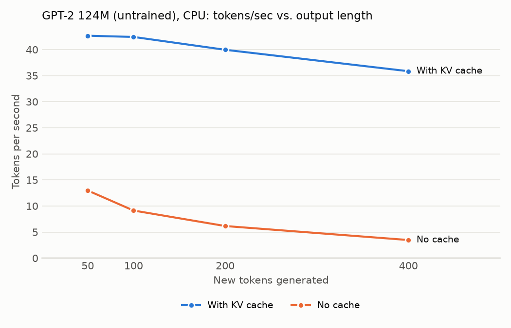

# What the KV cache actually buys you

I spent a few days ramping up on LLMs by reading the first couple of chapters of *The Welch Labs Illustrated Guide to AI*, and then working through the first few chapters of *Build a Large Language Model (From Scratch)* by Sebastian Raschka. I had Claude copy Raschka's code into a file for me, and we annotated it line by line to test my understanding of it. You can see that work here: [`gpt_annotate.py`](project/gpt_annotate.py).

After completing chapter 4 of Raschka's book, I read his essay, [*Understanding and Coding the KV Cache in LLMs from Scratch*](https://magazine.sebastianraschka.com/p/coding-the-kv-cache-in-llms) to understand how to speed up text generation. I then annotated his KV cache version of the code, which you can see here: [`gpt_kv_annotate.py`](project/gpt_kv_annotate.py).

## 1. Question

In this project, I'm investigating how much faster a GPT-2-sized model of 124 million parameters generates text with a key-value cache (KV cache) than without it, and how that difference changes as the output gets longer. 

## 2. Background

I won't get into all of the specifics of how an LLM works here, but there are essentially two stages to working with one: the training phase and the inference phase. The training phase involves the use of backpropogation to improve the model, and the inference phase is when you're ready to start asking the model questions. 

 A KV cache is a tool that speeds up a model during the inference phase. To borrow Raschka's example, if you provide an LLM with the token "Time", and ask it to generate the next token, it might come up with "flies". If you ask it to generate another token, it will reread "Time" and "flies" and it might suggest "fast". The problem is that when it generates "fast", without a KV cache, it's recomputing the key and value vectors for "Time" three times, and "flies" twice, and the problem continues as you ask it to generate more tokens. 

If you're new to understanding the specifics of LLMs like I am, you may wonder, "But wait, doesn't 'fast' influence the meaning of 'time' and 'flies'? Otherwise, how does the model handle adjectives, which nearly always precede an object, and therefore change the meaning and context of the adjective after the added context of the noun?"

However, in causal language models, a causal mask forces a strict one-way street where past tokens like "Time" and "flies" are forbidden from changing their values when a new word like "fast" arrives. When the model calculates the keys and values for "Time" and "flies", it's done with the math on them. But the word "fast" does get to calculate its keys and values based on the prior two tokens. 

The same rules apply during the training phase as well. During training, the computer feeds the entire sentence "Time flies fast" into the GPU all at once to save time. However, the causal mask is still actively blocking the model's view. Without this mask, the model would learn to just "cheat". Rather than calculating any scores at all, it would simply learn to look ahead one token to figure out what to write--this would of course fail in the inference stage, where it has to write a new token all on its own, and there are no future tokens to cheat off of. 

Each token's data is stored in a row. So when the network calculates the math for row 1, which is "Time", the mask completely hides "flies" and "fast". Then, when it calculates row 2, which is "flies", the mask hides "fast". The context vectors generated for "Time" and "flies" are unaffected by the word "fast". 

The only way that "fast" influences "Time" and "flies" is indirectly, after the sentence has been read, through backpropagation. This only happens in the training phase. After reading the full sentence, the AI looks at its prediction for the word after "flies" and realizes it should have guessed "fast". It then calculates its loss on that word, and sends a calculus signal backward to tweak the model's global, shared weight matrices. This calculus signal tells the model what direction to turn the weight and by how much. This means that "fast" doesn't change how "Time" was calculated. Instead, it changes the global weights of the model so that the next time the AI encounters the words "Time" or "flies" in a future training cycle, it will be more likely to predict "fast".

However, the big takeaway is that the KV cache reduces the time it takes a model to generate more tokens. This project investigates by how much, on my personal machine. 

## 3. Hypothesis

1. **Speed vs. output length, no cache:** Without the cache, I think the generation speed in tokens per second will decrease as the output length increases. This is because the model must reprocess the entire accumulated sequence at every single step, so the computational burden will compound and make 400 tokens noticeably slower per token than 200 tokens.
2. **Speed vs. output length, with cache:** With the cache enabled, I think the generation speed will remain relatively constant regardless of output length. Because the model is only computing the key and value vectors for the newly generated token at each step, it avoids repeating past work, but there's not really any reason the speed should increase with every subsequent token.
3. **Speedup on my machine vs. Raschka's M4:** I think Raschka's machine is a lot faster than mine, (especially because I refuse to close my dozens of Chrome tabs), but I think the scale of speedup that Raschka sees will be similar to mine. I think it would be weird if the scale changed, considering I'm using his code!
4. **Correctness:** My model should generate the same output with and without the cache, which should also be the same as Raschka's output. I should note that our models currently output gibberish, because they haven't been trained yet. 
5. **Speedup vs. output length:** The speedup ratio, calculated as the no-cache time / cache time, will grow larger as the output sequence length increases. Without the cache, the redundant work of pushing tokens through the transformer layers should scale quadratically relative to the sequence length. With the cache, we get rid of the redundant work and scale linearly. As a result, the efficiency gap will widen, meaning the KV cache is a lot more useful at 400 tokens than at 200 tokens.


## 4. Setup

Here is some information about the machine I am running my tests on. 

| | |
| --- | --- |
| Machine | 13-inch MacBook Pro, Intel Core i5-1038NG7 @ 2.00 GHz (4 cores / 8 threads), 16 GB RAM |
| OS | macOS 15.4 |
| Device | CPU (no GPU used) |
| Python | 3.11.0 |
| PyTorch | 2.2.2 (last release with Intel Mac builds) |
| NumPy | 1.26.4 (pinned `numpy<2` to work with PyTorch 2.2.2) |
| tiktoken | 0.14.0 |
| Code | [rasbt/LLMs-from-scratch](https://github.com/rasbt/LLMs-from-scratch) `ch04/03_kv-cache/`, commit `cdbd33e`, files unmodified: `gpt_ch04.py` (no cache), `gpt_with_kv_cache.py` (cache) |
| Model | GPT-2 124M architecture, **random (untrained) weights**, `torch.manual_seed(123)` |
| Prompt | "Hello, I am" (4 tokens) |
| Decoding | Greedy (argmax) |

## 5. Method

There are two parts to this experiment. We first complete a quick baseline that runs Raschka's scripts exactly as he does, and then we run the main experiment, which varies the output length.

**Baseline:** I ran Raschka's two scripts directly, unmodified, once each, and recorded the time and tokens/sec they print:

```bash
python ch04/03_kv-cache/gpt_ch04.py            # no cache
python ch04/03_kv-cache/gpt_with_kv_cache.py   # with cache
```

**Output-length experiment:** Raschka's scripts hardcode 200 new tokens. To test other lengths without editing his files, I wrote [`experiment.py`](project/experiment.py), which imports his two files as modules and calls his functions directly. It...

1. Builds two fresh, untrained GPT-2 124M models, one from each of Raschka's files, using his config and the same random seed (123), so both start with identical weights.
2. Encodes the prompt "Hello, I am" (4 tokens) with the GPT-2 tokenizer.
3. Does one short warm-up run (10 tokens) per version, untimed, so one-time startup costs don't land in the first measurement.
4. For each output length (50, 100, 200, and 400 new tokens), it runs each version 3 times, back to back: no cache, then cache.
5. After every run, it checks that both versions produced exactly the same token IDs (`torch.equal`).
6. Reports the median of the 3 times for each version and length, and computes tokens/sec and speedup from the medians.
7. Saves every individual run to `project/results.csv` and draws the chart.

To reproduce, from this repo's root folder:

```bash
~/Documents/GitHub/LLMs-from-scratch/.venv/bin/python project/experiment.py
```

**How tokens/sec is calculated:** In the experiment, tokens/sec is equal to the new tokens generated divided by the median time. I don't count the 4 prompt tokens, because they aren't generated. They are read once at the start. Counting them would also inflate short runs more than long ones because 4 extra tokens is 8% of 50, but 1% of 400. The baseline is different. Raschka's scripts divide the whole output, 204 tokens (4 prompt + 200 new), by the time. I kept his formula there so my numbers compare directly with his. The speedup is equal to the no-cache median time divided by the cache median time, at the same output length.

**Controls:** These are kept the same across every run.
- The model weights use the same seed.
- The prompt is the same.
- I use the CPU only. 
- I use PyTorch's default thread count and the same Python process for all runs.
- My computer was plugged in for every run.
- I had a bunch of Chrome tabs open, Claude's desktop app was running, and so was OneNote and a few other apps. However, I didn't touch the computer while it ran, so hopefully that didn't affect my output too much.

## 6. Results

Measured on Sunday, October 4, 2026. All raw timings are in [`results.csv`](project/results.csv).

### 6.1 Baseline: 200 new tokens, compared with Raschka

Raschka's two scripts, run unmodified, one run each, generating 200 new tokens. Tokens/sec uses his formula: (4 prompt tokens + 200 new tokens) ÷ time.

| | No cache (tok/s) | With cache (tok/s) | Speedup |
| --- | --- | --- | --- |
| Raschka, M4 Mac Mini CPU (source: `ch04/03_kv-cache/README.md`) | 27 | 144 | 5.3x |
| Me, Intel i5-1038NG7 CPU | 5.4 | 25.1 | 4.7x |

My runs took 37.96 s without the cache and 8.13 s with it. Raschka reports only tokens/sec.

Note: These single runs were slower than the 3-run medians for 200 tokens in section 6.2 (32.50 s and 5.00 s). The baseline scripts have no warm-up run, and each was run once.

### 6.2 Speed vs. output length

Median of 3 runs per setting. Tokens/sec = new tokens / median time. Speedup = no-cache median / cache median.

| New tokens | No cache: runs (s) | No cache: median (s) | No cache (tok/s) | Cache: runs (s) | Cache: median (s) | Cache (tok/s) | Speedup |
| --- | --- | --- | --- | --- | --- | --- | --- |
| 50 | 3.92, 3.83, 3.85 | 3.85 | 13.0 | 1.17, 1.17, 1.16 | 1.17 | 42.7 | 3.3x |
| 100 | 11.29, 10.87, 10.96 | 10.96 | 9.1 | 2.33, 2.41, 2.36 | 2.36 | 42.4 | 4.6x |
| 200 | 32.50, 33.69, 30.91 | 32.50 | 6.2 | 5.16, 5.00, 4.95 | 5.00 | 40.0 | 6.5x |
| 400 | 115.34, 114.92, 117.24 | 115.34 | 3.5 | 10.56, 11.16, 12.39 | 11.16 | 35.8 | 10.3x |



### 6.3 Correctness

All 12 timed run pairs (4 lengths x 3 runs) produced identical token IDs with and without the cache, checked in code with `torch.equal` after every run. The two baseline runs in section 6.1 also produced the same 204 token IDs and the same decoded text.

My output also matches the sample Raschka shows in `ch04/03_kv-cache/README.md`, as far as his excerpt goes (he truncates it with "..."):

> Hello, I am Featureiman Byeswickattribute argue logger Normandy Compton analogous bore ITVEGIN ministriesysics Kle functional recountrictionchangingVirgin embarrassedgl ...

### 6.4 KV cache memory (MHA vs. GQA vs. MLA)

These values come from Raschka's estimator script, `ch04/05_mla/memory_estimator_mla.py`, which multiplies out the model settings. No model actually runs. My settings were GPT-2 124M (`--emb_dim 768 --n_heads 12 --n_layers 12`), fp32 (4 bytes per number, matching my benchmark), and a batch size 1.

- **MHA** / multi-head attention, what my benchmark used: Every one of the 12 heads stores its own keys and values.
- **GQA** / grouped-query attention, `--n_kv_groups 4`: Query heads share key/value heads in groups of 4, so 12 query heads use 3 key/value heads. Example value, not a GPT-2 setting.
- **MLA** / multi-head latent attention, `--latent_dim 192`: Each token's keys and values are compressed into one 192-number latent per layer. Example value, not a GPT-2 setting.

| Context length (tokens) | MHA | GQA | MLA |
| --- | --- | --- | --- |
| 1,024 | 75.5 MB | 18.9 MB | 9.4 MB |
| 4,096 | 302 MB | 75.5 MB | 37.7 MB |
| 32,768 | 2,416 MB (2.42 GB) | 604 MB | 302 MB |
| **Ratio vs. MHA** | 1x | 4x smaller | 8x smaller |

GPT-2 can only handle 1,024 tokens, so the 4,096 and 32,768 rows are hypothetical. They show how the cache would grow for a model with these settings and a longer context. The script prints GB rounded to two decimals, for example, 0.08 / 0.02 / 0.01 GB at 1,024 tokens, and the MB values above use the script's own formula without rounding.

## 7. Analysis

All of my hypotheses were correct, except for hypothesis #2. That one was mostly correct, but the cached speed was slightly more than constant.

**1. No cache, speed drops as the output gets longer:** Confirmed. Tokens/sec fell from 13.0 at 50 tokens to 3.5 at 400. Going from 200 to 400 tokens took 3.5x as long (32.50 s to 115.34 s), not 2x. That's close to what the quadratic math predicts. Without the cache, generating 200 tokens pushes 20,700 token positions through the model (4 + 5 + 6 + … + 203), and 400 tokens pushes 81,400, about 4x as many. The time grew a little less than the work, which points to the next finding.

**2. With cache, speed stays roughly constant:** Mostly confirmed. This slope was much flatter than the no-cache line, but it wasn't perfectly flat. It drifted from 42.7 tokens/sec at 50 tokens to 35.8 at 400, which was a 16% drop. My hypothesis stated that the cache means the model only computes keys and values for the new token, which is true, but there are other costs associated with a step. The new token's query still has to be compared against every cached key, and the cache gets longer with every token. In Raschka's code, `torch.cat` also builds a new, bigger copy of the cache on every step, so each token costs slightly more than the one before it.

**3. Speedup similar to Raschka's:** Confirmed. At 200 tokens, using his formula, I got a 4.7x speedup versus his 5.3x, even though his M4 was about 5 - 6x faster than my Intel laptop in absolute terms. This speedup can obviously be attributed to the cache working, but absolute speed comes down to the hardware. 

**4. Correctness:** Confirmed. Every run produced identical tokens with and without the cache, and my output matches the sample in Raschka's README. This makes sense -- the cache is a pure speed optimization, so it changes how much work is done, not the answer.

**5. Speedup grows with output length:** Confirmed. The speedup went from 3.3x at 50 tokens to 10.3x at 400. The no-cache cost grows with the square of the length, while the cached cost grows roughly in a straight line, so the gap keeps widening. The longer the output, the more the cache matters, and real chat responses and long documents are much longer than 400 tokens.

**Why isn't the speedup bigger?** At 200 tokens, the cache cuts the work from 20,700 token positions to about 203, roughly 100x less. But the speedup was only 6.5x. My own numbers explain why this occurs. At 50 tokens, a cached step or 1 token took about 23 ms on average (1.17 s / 50), while a no-cache step, which is about 29 tokens on average, took about 77 ms (3.85 s / 50). Processing 29x more tokens only took about 3.3x longer.

That's because every step has a large fixed cost that doesn't depend on how many tokens go in. The model has to read all of its weights, which is about 163 million numbers, or roughly 650 MB from memory on every single step. With one token per step, most of the time is spent retrieving data from the cache, not generating. This is why decoding or generating one token at a time is described as memory-bound. The bottleneck comes from moving data, not from doing math.

**What are the tradeoffs of using the cache?** The cache trades memory for speed. For this model, the cache is about 72 KB per token, or 75.5 MB at its 1,024-token limit, and it grows in a straight line with context length. At a hypothetical 32,768 tokens, it would reach 2.42 GB, about 3.7x the size of the model's own weights. Further, this memory burden grows by user and conversation. GQA and MLA shrink the cache by a constant factor, but it still grows with every token, which is why serving systems also use techniques like paged and quantized caches.

**What didn't I test?** GPUs. Raschka notes that for a model this small, the speedup can disappear on a GPU, because the overhead of moving data to and from the GPU outweighs the savings. I ran everything on a CPU, so these results don't say anything about GPU performance.

## 8. Limitations

- All of the timings come from my one Intel laptop. In his essay, Raschka says that a GPU could show a different pattern.
- I didn't close background apps. The 3 runs per setting were close to each other so the noise should be small, but it's not zero.
- 3 runs per setting is enough to spot a trend, but not enough for tight error bars.
- My model is super small--it's only 124M parameters with random weights. Real models are much bigger, which changes the balance between computing and moving data.
- Raschka's implementation is written for learning, which means it's not super optimized. Production inference engines like TensorRT LLM or vLLM would pre-allocate the cache, use optimized GPU kernels, and batch many users together, so their absolute numbers would be very different.
- I stopped at 400 tokens because the no-cache run gets slow fast. It was also at almost 2 minutes per run at 400 tokens. Real outputs and contexts are often thousands of tokens.
- The memory numbers are calculated, not measured, and the GQA and MLA settings are example values, not settings from a real model.

## 9. Conclusion

On my laptop, the KV cache made text generation 3.3x faster for a 50-token output and 10.3x faster for a 400-token output. Both outputs were identical, and the gap would keep growing as the output would grow. The speedup is smaller than the roughly 100x reduction in work, because each generation step is dominated by reading the model's weights from memory. The tradeoff here is memory. The cache grows with every token, which is why making it smaller (GQA, MLA, paging, quantization) is a central problem in LLM serving.

## 10. Setup snags

I ran into some miscellaneous issues while doing this project. 

- One Chapter 2 notebook cell errors on purpose. Rashka demonstrates an error in the tokenizer section, which prevents "Run All" from executing properly for every cell after it.
- When I ran `pip install` it gave me incompatible PyTorch and NumPy versions. PyTorch stopped shipping Intel Mac builds after 2.2, so I had to pin `numpy<2`.